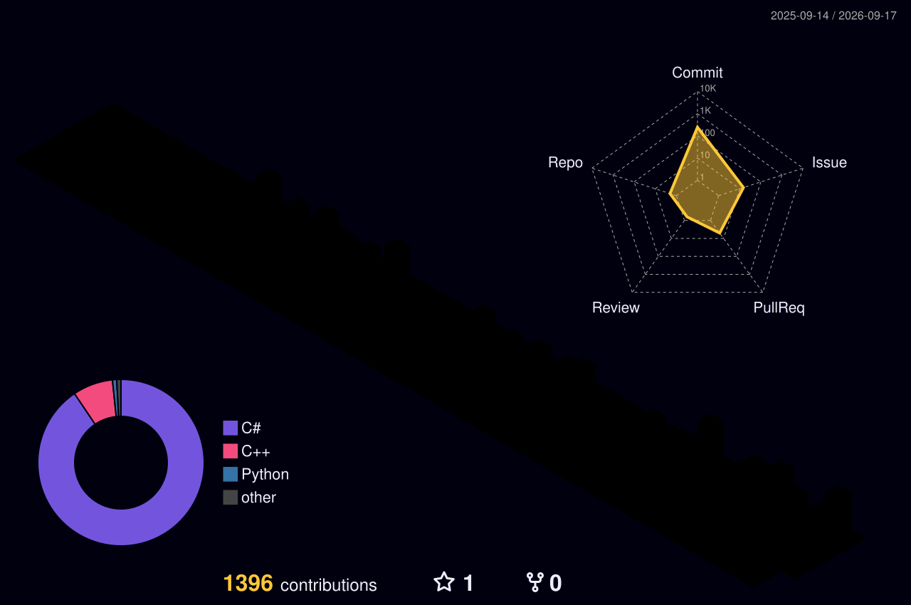

## 🛠 Tech Stack

**Engine & Language**

**Unity**

**Network & Backend**

-4B32C3?style=flat-square&logoColor=white)

**Platform & Tools**

## 📊 Stats

## 🏆 Awards

- **NHN AI 해커톤 본선 챌린지상** — NHN
- **2026 메커톤 우수상** — 넥슨코리아
- **2025 루키 게임 콘테스트 2위** — 게임핑
- **2026 딩가딩 프로젝트 서포터즈** — 펄어비스
- 한국멀티미디어학회 논문지 제29권 제8호(2026.8) 게재 예정

